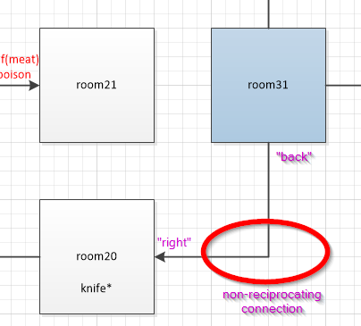

# Overview
*Adventure* is an old-school text-driven adventure game with a level-creation kit. It was written in the summer of 2020 as a pedagogical exercise to teach my children to code Python. It is designed to teach the basics of Python with lightweight classes (object-oriented programming). Despite being text-driven, it does render a graphical view of the current room and player inventory and stats using the Turtle module. The game currently includes some example levels for illustration purposes.

The game is written in Python and should work with version 3.6 or higher

# Quick Start
- Make sure you have the Python interpreter installed on your system. See [here](https://www.python.org/downloads/)
- Make sure to have Git installed on your system (on Linux and Mac these will be included). For windows
- In a shell (e.g. Git-bash on Windows), clone this repository into a folder `git clone https://github.com/sebastian-ahmed/adventure_game.git`
- Run the game either directly `game.py` or depending on your system you may need to do `python game.py` or `python3 game.py`
- The game should start and you can enter your name and choose a level

# Creating a New Level
*Adventure* was designed primarily as an engine to enable level design (via a Python API). Creating a new level has two main steps:
1. Design a level on paper (this is the level design)
1. Code the level based on your design

## Level Constructs
In this version of Adventure, there are only four mahojor types of things involved in designing a level
1. Locations : these are essentially the "rooms" of the game. Locations are 2-dimensional spaces which have up to four(4) connectors to other locations
1. Connectors : These are the objects which connect Locations
1. Obstructions : These are generic obstacles that can be associated with Connectors. Obstructions can:
    - Block a connector (blocking a pathway such as a locked door or danger)
    - Cause damage to the player (useful for obstructions which are enemies)
    - Be resolved with an item (e.g. water could put out a fire)
    - Drop items
1. Items : These are simply string objects to describe in-game items. Items can be used to resolve obstructors and can be picked-up or dropped by the player
    - GameItems : These are built-in items (currently these are limited to *healthpack*)

The player has a limited inventory of four(4) items.

## Level Design
This is the part where you have to use your game-level design skills and imagination. The actual level-design is best done on paper or with a drawing package. This becomes the *specification* for the level coding. Below is the design of "level4":

Note that in this diagram, all the level constructs are shown. The Connector between room11 and room21 for example show the case of an Obstructor (wolf) which blocks the path, can cause player damage, can be resolved with "meat" and will drop "poison" for the player to pick up

## Connector Symmetry
Note that in the above level, all Connectors are **reciprocating**. This means that the perspective of the connection is always the opposite from one Location to another. It is in-fact possible to not follow this, to create interesting and confusing room connections. This was a technique used in "level3" and is shown below:

The reason this is considered **non-reciprocting** is because from the perspective of room31 if you "go back" you will end up in room20. In room20, the opposite action to "go forward" will not take you back to room31. You have to instead "go right". This type of connection should be used very sparingly and in fact the level creation API requires explicit coding of this, because by default it automatically creates reciprocating connections.

## Level Coding
Once you have designed the level, the coding is very simple. In fact this is the first part that your child student could perform after learning the basics of Python. The steps are as follows:
1. Add a new file in the `levels` sub-folder. Give it any name you like (just add the .py extension since it will be python file). Starting with one of the example levels is best
1. Modify `levels.json` in the top directory to add the new level entry
1. Code your new level into your level file (again following one of the examples)

The general structure of a level file is shown below:
1. Import game object classes
1. Initialize a new Level object with a name
1. Create Location objects with descriptions adding each object to the Level object as you go
    - Mark the exit location with the `endLocation=True` argument setting
1. Create Obstructor objects. Initializing an Obstructor consists of five arguments
    - The base-name string (e.g. "snake")
    - A prefix string for the unresolved state (e.g. "hissing") resulting in "hissing snake"
    - A prefix string for the resolved state (if applicable, e.g. "dead" resultiung in "dead snake"
    - The Item string which resolves Obstructor. `resolutionItem=None` for un-resolvable
    - A boolean flag to determine if this Obstructor can damage the player when the player moves in its direction
1. For Obstructors which can drop items upon resolution, call `setItem`, e.g. `wolf.setItem('poison')`
1. Add items (string values) to each relevant location object, e.g. `room23.addItem('black-key')`
1. Connect the locations
    - The game-engine *automatically makes reciprocating connections*, so only one side of each connection needs to be specified (see 'level3' for an examnple of non-reciprocating connections)
    - Attach Obstructor objects to the appropriate connectors (e.g. `obs=wolf`)
1. Set the start location in the Level object

Messing up connections is the typical bug which can happen during level construction so care must be taken during this step.

## Automated Level Debug
As of now, the main tool for debugging levels (besides playing them) is to use the `level_analyzer.py` script. This script has a similar interface to `game.py` in that it asks the user for a registered level to be analyzed.
The Location graph actually forms a *quad-linked-list* data structure. The analysis script will recursively analyze the graph and report the number of locations it found and compare this with the Level object in the level file amongst other things. The output of the analyzer is a bit rudimentary but it works for catching most issues

A future update will feature a player-emulator to allow playing of a full level to be scripted and checked.

# Feature and Task Backlog
- Add a player-emulation mode to enable a programmatical level test (i.e. capture player actions in a script and have the game execute the script vs key-strokes)
- Add automated unit tests (both for classes and levels). Level unit-tests should be mandatory as part of level design (essentially the walkthrough as a scripted description)
- Add more source-level documentation
- De-couple concept of blocking and resolvable obstructions. For example, allow a "fire" which you can pass through with damage to be put out with "water"
- Add a level chaining feature, i.e., instead of ending at the “exit room”, load a next-level (if specified). This could be used to implement multiple floors (upstairs, downstairs etc)
